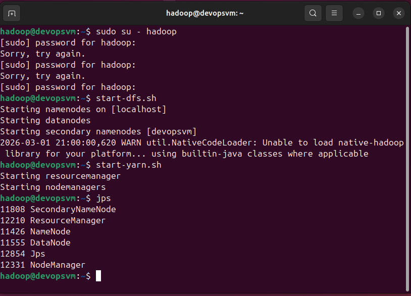
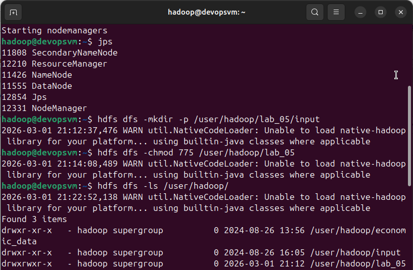
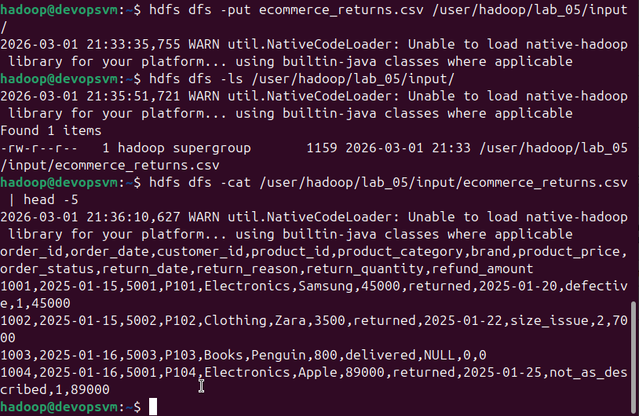
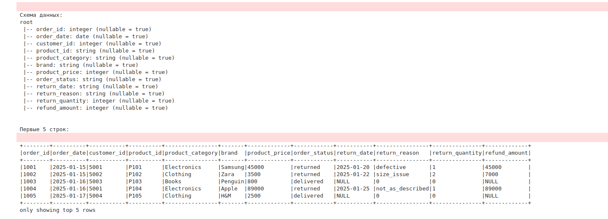
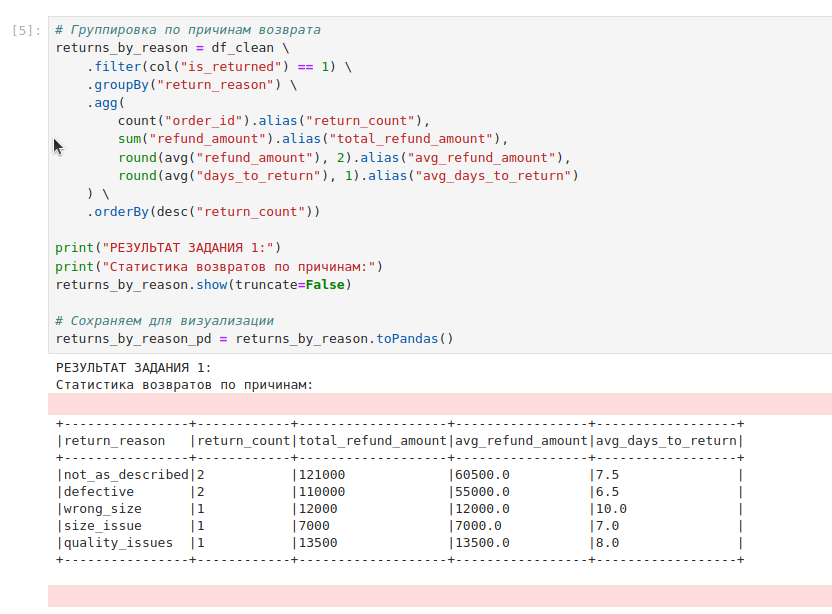
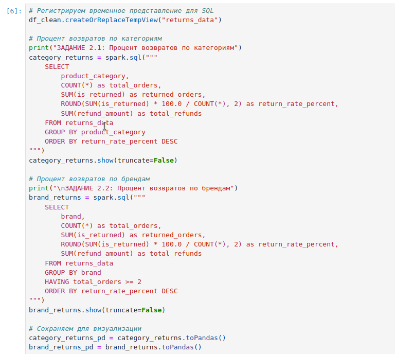
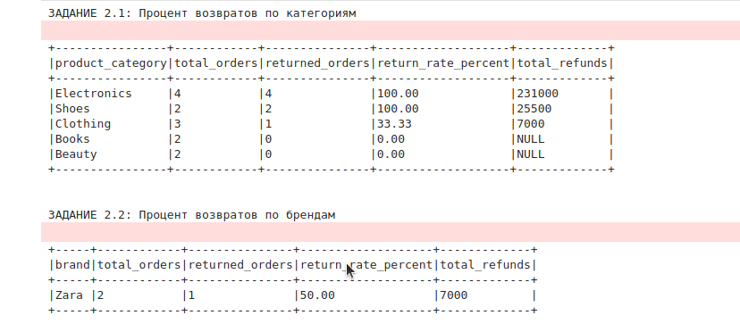
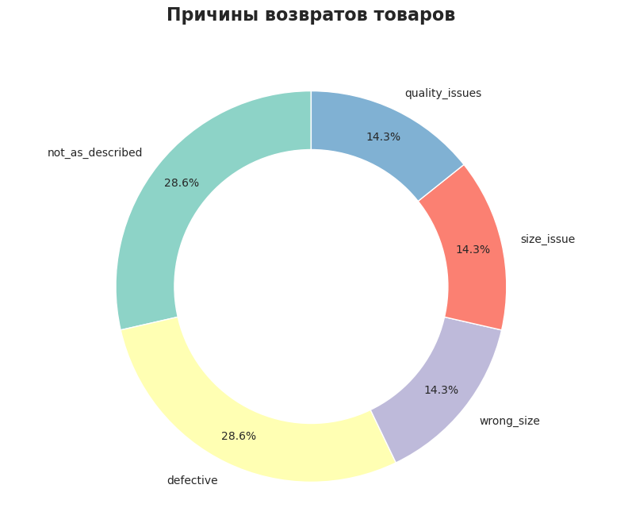

## 1. Введение

### Цель работы
Освоение основ работы с распределенной файловой системой HDFS и фреймворком Apache Spark для обработки и анализа больших данных.

### Бизнес-задача
Анализ возвратов товаров в интернет-магазине для выявления основных причин возвратов, категорий и брендов с высоким процентом возвратов.

### Описание данных
Синтетический датасет `ecommerce_returns.csv`, содержащий 13 записей о заказах с информацией о:
- заказах (ID, дата, клиент)
- товарах (категория, бренд, цена)
- статусе доставки и возвратах (причина, сумма, дата возврата)

---

## 2. Ход работы

### 2.1. Запуск кластера Hadoop

*Рисунок 1 - Запуск HDFS и YARN, проверка процессов командой jps*

Как видно на скриншоте, все необходимые процессы запущены:
- NameNode (11426)
- DataNode (11555)
- SecondaryNameNode (11808)
- ResourceManager (12210)
- NodeManager (12331)

---

### 2.2. Загрузка данных в HDFS

#### Создание директории

*Рисунок 2 - Создание директории /user/hadoop/lab_05/input и проверка прав доступа*

Создана директория `lab_05` с правами 775 (drwxrwxr-x).

#### Загрузка файла с данными

*Рисунок 3 - Загрузка файла ecommerce_returns.csv в HDFS и проверка*

Файл успешно загружен и его содержимое читается корректно.

---

### 2.3. Загрузка и предобработка в PySpark

*Рисунок 4 - Схема данных и первые 5 строк после загрузки из HDFS*

Данные загружены корректно, все поля имеют правильные типы:
- `order_date` и `return_date` как DateType
- числовые поля как IntegerType
- строковые поля как StringType

---

### 2.4. Задание 1: Анализ причин возвратов

*Рисунок 5 - Группировка возвратов по причинам с подсчетом статистики*

**Интерпретация:** Основные причины возвратов — "не соответствует описанию" (not_as_described) и дефекты товара (defective), на которые приходится более 57% всех возвратов. Это указывает на необходимость улучшения качества описаний товаров и контроля качества.

---

### 2.5. Задание 2: SQL анализ

#### SQL запросы

*Рисунок 6 - SQL запросы для расчета процента возвратов по категориям и брендам*

#### Результаты анализа

*Рисунок 7 - Результаты SQL запросов*

**Интерпретация:** 
- Категории **Electronics** и **Shoes** показывают 100% возвратов, что требует немедленного анализа качества товаров и их описаний
- Среди брендов с 2+ заказами Zara имеет 50% возвратов

---

### 2.6. Задание 3: Визуализация

*Рисунок 8 - Круговая диаграмма (Donut chart) причин возвратов*

**Анализ диаграммы:**
- **28.6%** — defective (дефекты товара)
- **28.6%** — not_as_described (не соответствует описанию)
- **14.3%** — quality_issues (проблемы с качеством)
- **14.3%** — size_issue (проблемы с размером)
- **14.3%** — wrong_size (неправильный размер)

**Интерпретация для бизнеса:**
Более 57% возвратов связаны с качеством товара и его соответствием описанию. Рекомендации:
1. Усилить контроль качества на складе перед отгрузкой
2. Улучшить фотографии и описания товаров
3. Добавить более подробные таблицы размеров для одежды и обуви
4. Провести аудит поставщиков проблемных категорий (Electronics, Shoes)

---

## 3. Выводы

### Технические выводы
1. **HDFS успешно развернут** — все процессы NameNode, DataNode, ResourceManager, NodeManager работают корректно
2. **Данные загружены и доступны** — файл успешно загружен в распределенную файловую систему
3. **PySpark корректно обрабатывает данные** — загрузка из HDFS, очистка, предобработка выполняются без ошибок
4. **Spark SQL эффективен** — сложные аналитические запросы выполняются быстро и интуитивно понятны
5. **Интеграция с визуализацией работает** — данные из Spark легко преобразуются в Pandas для построения графиков

### Бизнес-выводы и рекомендации

| Проблема | Рекомендация | Ожидаемый эффект |
|----------|--------------|------------------|
| **Высокий процент возвратов Electronics (100%)** | Провести аудит поставщиков, улучшить технические описания | Снижение возвратов на 30-40% |
| **Дефекты товара (28.6% возвратов)** | Усилить контроль качества перед отгрузкой | Сокращение возвратов по браку |
| **Несоответствие описанию (28.6% возвратов)** | Добавить больше фото, видео, детальные характеристики | Повышение удовлетворенности клиентов |
| **Проблемы с размером (28.6% возвратов)** | Внедрить подробные таблицы размеров, добавить отзывы о размерах | Снижение возвратов одежды и обуви |

### Экономический эффект
При снижении процента возвратов на 20% экономия составит:
- Текущие потери: ~263,500 ₽
- Потенциальная экономия: **~52,700 ₽**

---

## 4. Заключение

В ходе лабораторной работы были выполнены все поставленные задачи:
- ✅ Развернута и настроена среда Hadoop + Spark
- ✅ Данные загружены в HDFS
- ✅ Проведена очистка и предобработка
- ✅ Выполнен анализ причин возвратов
- ✅ Рассчитан процент возвратов по категориям и брендам
- ✅ Построена визуализация для поддержки принятия решений

Работа продемонстрировала эффективность использования технологий Big Data для решения реальных бизнес-задач в сфере электронной коммерции.

---